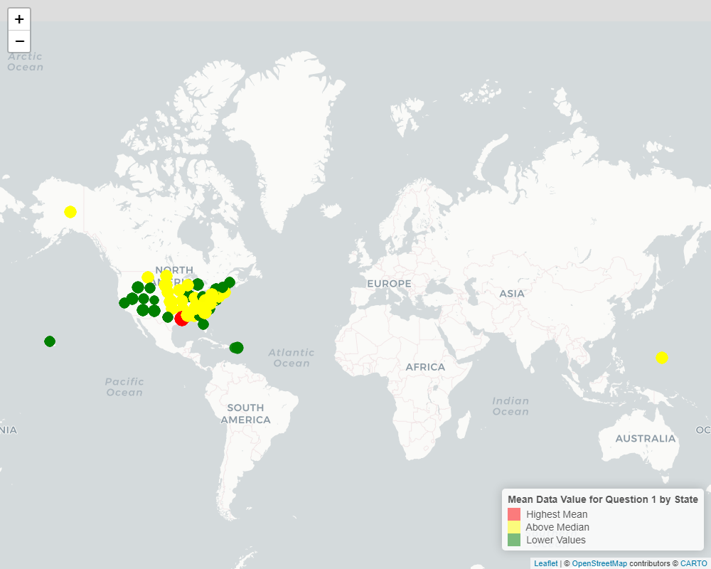
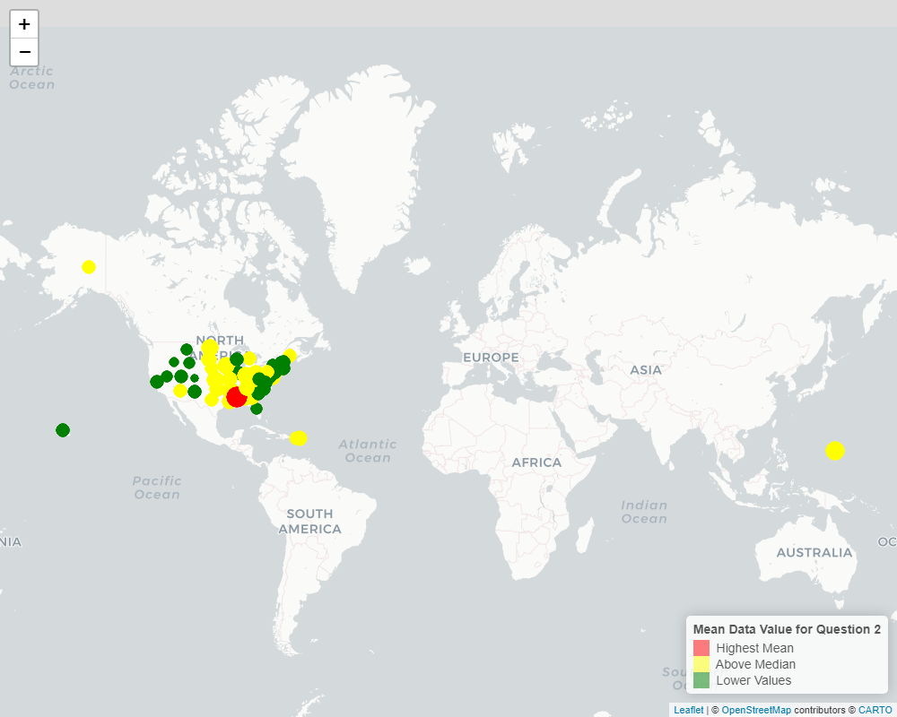

## Introduction

The dataset Nutrition, Physical Activity, and Obesity, was acquired from the Centers for Disease Control and Prevention through the Youth Risk Behavior Surveillance System. In this dataset, there is information on high school students in grades 9-12 from public and private schools regarding their diet, physical activity, and weight. This data helps inform the Division of Nutrition, Physical Activity, and Obesity which in turn contributes to the  national and state data on these markers.

Current research shows that non-Hispanic Black adults have a higher prevalence of obesity followed by Hispanic adults. Midwestern and Southern regions have a higher prevalence of obesity according to the Centers for Disease Control and Prevention. The goal of this analysis is to analyze if the data collected from high school students through the Youth Risk Behavior Surveillance System shows a trend for obesity according to location and race/ethnicity. For my analysis I will be exploring the following questions:

1)  Does obesity and weight status differ by state?
2)  Does obesity and weight status differ by ethnicity?

## Methods

### How and Where the Data were Acquired

The data were acquired from the Youth Risk Behavior Surveillance System where surveys were given to national, state, territorial, tribal, and large urban schools from grades 9-12 in U.S. high schools. Students were randomly selected to participate based on their required classes or a specific period of the school day. I used the API pertaining to the data but had to modify the default limit to allow all 44,702 observations and 31 columns to allow for all data to be analyzed with no limit.

### Missing Values and Filtering Data 

I assessed missing values for the key variables which included:locationdesc, geolocation, data_value, race_ethnicity, class, and question. I then filtered the dataset for only relevant class observations including "Obesity/Weight Status." Because this analysis is focused on obesity/weight pertaining to state and ethnicity, I kept only relevant key variables mentioned above. After missing values were removed, the observations went from 44,702 to 3,028 observations.

### Transformation from Longer to Wider 

To better visualize and compare data, I transformed the variable "question" into a binary variable where 1 = "Percent of students in grades 9-12 who have an overweight classification" and 2 = "Percent of students in grades 9-12 who have obesity." To include more variables rather than observations, I transformed the data from longer to wider. By aggregating the data so that each column had a single data value, I created Question 1 and Question 2 as two separate variables so that each location pertaining to the obesity/weight status has a column for Question 1 and another for Question 2 with their corresponding data values in percentages.

### Exploratory Data Analysis Tools 

For exploratory data analysis, I used ggplots and bar plots to assess individual variables and explore their distribution. In doing this, I assessed the contribution of counts each location and race/ethnicity provided to the overall dataset as well as to Question 1 and 2 individually. Summary statistics were also generated in descending order according to question 1 or 2. The summary statistic tables aided in the comparison of which race/ethnicity and location had the highest means based on question 1 or 2 in the dataset.


<!-- --> 

<!-- --> 

<!-- --> 
<!-- --> 


## Results

### Table 1

Table 1 was created to assess the mean data values of Question 1 (Percent of students in grades 9-12 who have an overweight classification) and Question 2 (Percent of students in grades 9-12 who have obesity) according to location. From Table 1, we can see that Guam had the highest percentage of students in grades 9-12 who have obesity (20.33%) followed by Mississippi in the same question category (19.63%). Louisiana had the highest percent of students in grades 9-12 who have an overweight classification (18.72%) followed by Arkansas (18.14%).


```
## 
## Attaching package: 'kableExtra'
```

```
## The following object is masked from 'package:dplyr':
## 
##     group_rows
```


\begin{longtable}[t]{lrrrrr}
\caption{\label{tab:unnamed-chunk-22}Table 1: Summary Statistics for Location and Question}\\
\toprule
locationabbr & questions\_coded & Mean & Median & Count & SD\\
\midrule
MS & 2 & 21.890278 & 22.977778 & 4 & 5.0485714\\
GU & 2 & 20.491667 & 20.033333 & 4 & 3.4792906\\
LA & 1 & 20.241071 & 19.146429 & 4 & 4.7195583\\
ND & 2 & 18.651515 & 19.550000 & 5 & 4.8538149\\
MS & 1 & 18.631944 & 18.163889 & 4 & 4.1857351\\
\addlinespace
OH & 2 & 18.523214 & 17.525000 & 4 & 5.4775093\\
KS & 2 & 18.435417 & 17.943750 & 6 & 5.9968764\\
IN & 2 & 18.390952 & 18.520000 & 4 & 4.1110703\\
AL & 1 & 18.325926 & 19.377778 & 3 & 2.4119643\\
KS & 1 & 18.320417 & 18.461250 & 6 & 2.8378339\\
\addlinespace
IA & 2 & 18.239583 & 18.150000 & 4 & 4.4918000\\
KY & 1 & 18.160370 & 18.227778 & 6 & 2.1508725\\
AR & 1 & 18.050625 & 18.070000 & 4 & 2.1373858\\
WV & 1 & 17.905000 & 17.905000 & 2 & 2.8213561\\
KY & 2 & 17.875185 & 17.858333 & 6 & 5.3262702\\
\addlinespace
SD & 1 & 17.851333 & 17.450000 & 5 & 4.0540628\\
AR & 2 & 17.675625 & 17.720000 & 4 & 1.3639257\\
SC & 1 & 17.476444 & 19.460000 & 5 & 2.9052713\\
TN & 1 & 17.424333 & 17.775000 & 5 & 2.4455116\\
AL & 2 & 17.400000 & 18.388889 & 3 & 4.4444028\\
\addlinespace
PA & 1 & 17.136667 & 18.700000 & 5 & 2.9909623\\
TN & 2 & 16.912000 & 19.600000 & 5 & 5.9993100\\
MO & 1 & 16.867407 & 17.840000 & 3 & 2.2080731\\
WI & 1 & 16.836048 & 17.275000 & 5 & 2.1019907\\
IN & 1 & 16.640714 & 16.850000 & 4 & 1.6002863\\
\addlinespace
OK & 2 & 16.618102 & 17.707500 & 6 & 2.5065889\\
DC & 1 & 16.489583 & 16.762500 & 6 & 5.6855102\\
RI & 1 & 16.479299 & 17.640000 & 5 & 2.4339589\\
GA & 2 & 16.397857 & 17.000000 & 5 & 2.7490401\\
NJ & 1 & 16.397143 & 17.585714 & 5 & 3.8011867\\
\addlinespace
ND & 1 & 16.379242 & 17.550000 & 5 & 3.6709232\\
NE & 1 & 16.346875 & 16.900000 & 4 & 1.7375862\\
VI & 2 & 16.200000 & 16.200000 & 2 & 5.3740115\\
AK & 1 & 16.173333 & 16.600000 & 5 & 1.6523384\\
MO & 2 & 16.141482 & 17.360000 & 3 & 2.2721419\\
\addlinespace
CT & 1 & 16.034444 & 16.750000 & 5 & 1.8650638\\
GU & 1 & 16.016667 & 16.450000 & 4 & 3.7758001\\
IA & 1 & 15.950000 & 14.950000 & 4 & 2.7525746\\
OK & 1 & 15.922222 & 16.754167 & 6 & 2.1782377\\
VA & 1 & 15.843333 & 15.900000 & 5 & 3.2186652\\
\addlinespace
MT & 1 & 15.836239 & 15.865079 & 6 & 4.5720687\\
NC & 1 & 15.731636 & 16.472727 & 5 & 2.6006841\\
DE & 2 & 15.686000 & 16.600000 & 5 & 2.2247539\\
DE & 1 & 15.668000 & 18.190000 & 5 & 4.4222246\\
LA & 2 & 15.653571 & 15.350000 & 4 & 1.8726232\\
\addlinespace
GA & 1 & 15.539643 & 15.800000 & 5 & 4.3864316\\
VI & 1 & 15.500000 & 15.500000 & 2 & 0.2828427\\
MI & 1 & 15.431840 & 15.895454 & 6 & 3.4581680\\
AZ & 1 & 15.406000 & 17.310000 & 5 & 3.3326536\\
MA & 1 & 15.371515 & 16.866667 & 5 & 4.1946699\\
\addlinespace
IL & 1 & 15.364167 & 17.025000 & 5 & 4.0738448\\
NM & 1 & 15.326389 & 15.612500 & 6 & 2.6610507\\
MD & 1 & 15.280884 & 15.840000 & 7 & 2.7601883\\
NV & 1 & 15.222143 & 14.900000 & 5 & 1.9625226\\
SD & 2 & 15.175333 & 15.566667 & 5 & 4.2002828\\
\addlinespace
NY & 1 & 15.123560 & 15.370000 & 7 & 2.8388393\\
ID & 1 & 15.039394 & 16.200000 & 3 & 2.3240449\\
HI & 1 & 14.961111 & 14.683333 & 6 & 3.3031579\\
NE & 2 & 14.896875 & 14.375000 & 4 & 2.8493123\\
VT & 1 & 14.889731 & 15.482222 & 6 & 2.3890904\\
\addlinespace
ME & 1 & 14.849783 & 15.200000 & 6 & 2.2102440\\
AZ & 2 & 14.824000 & 14.850000 & 5 & 4.6619234\\
PR & 1 & 14.750000 & 14.750000 & 1 & NA\\
ME & 2 & 14.736797 & 15.742857 & 6 & 3.5560622\\
AK & 2 & 14.550833 & 15.016667 & 5 & 2.6717471\\
\addlinespace
PA & 2 & 14.536667 & 16.233333 & 5 & 4.6397797\\
PR & 2 & 14.500000 & 14.500000 & 1 & NA\\
NH & 1 & 14.459167 & 14.190000 & 6 & 1.5646898\\
TX & 2 & 14.358889 & 14.933333 & 5 & 4.6318869\\
MI & 2 & 14.265527 & 15.193333 & 6 & 4.3111553\\
\addlinespace
FL & 1 & 14.044762 & 14.357143 & 5 & 2.9759340\\
WY & 1 & 14.019107 & 13.173214 & 4 & 3.2177940\\
CT & 2 & 13.993333 & 16.566667 & 5 & 4.8305011\\
TX & 1 & 13.987222 & 12.877778 & 5 & 3.9230010\\
UT & 1 & 13.962500 & 15.100000 & 3 & 3.2468013\\
\addlinespace
NC & 2 & 13.955636 & 14.881818 & 5 & 3.6487105\\
SC & 2 & 13.950667 & 14.000000 & 5 & 5.0538552\\
NH & 2 & 13.793333 & 14.187500 & 6 & 4.1587398\\
WV & 2 & 13.785000 & 13.785000 & 2 & 5.0699556\\
OH & 1 & 13.726190 & 13.535714 & 4 & 2.2572383\\
\addlinespace
IL & 2 & 13.477500 & 14.450000 & 5 & 3.8486138\\
WI & 2 & 13.414452 & 13.733333 & 5 & 2.0896007\\
RI & 2 & 13.388390 & 14.190000 & 5 & 2.6692186\\
VA & 2 & 13.360667 & 14.600000 & 5 & 4.3456219\\
CA & 2 & 13.350000 & 13.350000 & 4 & 5.4003086\\
\addlinespace
CA & 1 & 13.333333 & 11.983333 & 4 & 3.9077321\\
HI & 2 & 13.204630 & 12.888889 & 6 & 5.2737978\\
UT & 2 & 13.180000 & 13.250000 & 3 & 6.5552803\\
MD & 2 & 13.155601 & 14.520000 & 7 & 3.8342686\\
NM & 2 & 13.115807 & 13.819643 & 6 & 5.9504977\\
\addlinespace
VT & 2 & 12.891169 & 14.175000 & 6 & 3.9703721\\
WY & 2 & 12.750000 & 11.150000 & 4 & 5.2016023\\
MA & 2 & 12.515353 & 13.322222 & 5 & 3.7321363\\
NY & 2 & 12.337483 & 12.666667 & 7 & 3.0028566\\
DC & 2 & 12.212500 & 13.850000 & 6 & 5.3169893\\
\addlinespace
NV & 2 & 12.133571 & 12.800000 & 5 & 3.8756415\\
MT & 2 & 11.765628 & 13.321429 & 6 & 6.7307176\\
CO & 1 & 11.633333 & 9.833333 & 5 & 3.3791024\\
FL & 2 & 11.610447 & 11.771429 & 5 & 2.1064214\\
ID & 2 & 10.527273 & 8.600000 & 3 & 4.6974320\\
\addlinespace
NJ & 2 & 10.409048 & 9.000000 & 5 & 4.9775244\\
CO & 2 & 8.413333 & 6.900000 & 5 & 4.9545910\\
\bottomrule
\end{longtable}


### Table 2

To help address the question of whether obesity and weight status differed by ethnicity, Table 2 was created. From this table, we can see that Hawaiian/Pacific Islanders had the highest mean data value for percent of students in grades 9-12 who have obesity (18.05%) followed by the American Indian/Alaska Native community (17.98%). For race/ethnicity with the highest present of students in the overweight classification, Non-Hispanic Black students had the highest mean (18.04%) with Hispanic students following (17.70%).


\begin{longtable}[t]{lrrrrr}
\caption{\label{tab:unnamed-chunk-23}Table 2: Summary Statistics for Race/Ethnicity and Question}\\
\toprule
race\_ethnicity & questions\_coded & Mean & Median & Count & SD\\
\midrule
American Indian/Alaska Native & 2 & 18.955033 & 18.50000 & 17 & 4.412538\\
Hawaiian/Pacific Islander & 2 & 18.587540 & 19.04889 & 4 & 6.164833\\
Non-Hispanic Black & 1 & 17.701772 & 17.98939 & 44 & 2.020579\\
American Indian/Alaska Native & 1 & 17.699734 & 17.45000 & 17 & 2.517201\\
Hispanic & 1 & 17.637082 & 17.80750 & 50 & 2.154198\\
\addlinespace
Hispanic & 2 & 17.140585 & 16.78896 & 50 & 2.860944\\
Non-Hispanic Black & 2 & 16.732314 & 17.40500 & 44 & 2.595401\\
2 or more races & 1 & 16.267992 & 16.20000 & 45 & 3.044253\\
Hawaiian/Pacific Islander & 1 & 16.224286 & 16.28667 & 4 & 3.290938\\
2 or more races & 2 & 15.170445 & 14.88182 & 45 & 3.805146\\
\addlinespace
Non-Hispanic White & 1 & 13.453582 & 13.67500 & 48 & 1.595103\\
Asian & 1 & 13.009645 & 12.20000 & 34 & 3.783425\\
Non-Hispanic White & 2 & 11.234926 & 11.49886 & 48 & 2.805701\\
Asian & 2 & 9.188049 & 7.86250 & 34 & 4.466382\\
\bottomrule
\end{longtable}


### Confirming Results

To help with data visualization, I separated states into regions pertaining to Northeast, Midwest, South, and West. From here, I was able to create a bar plot with the average data values according to Question 1 and Question 2 stratified by region (Figure 5). The results supported Table 1 where the highest values of Question 1 were reported in the Midwest/South regions and the highest values for Question 2 being reported in the same regions. 


<!-- --> 

<!-- --> 


### Data Visualization

By creating pie charts of the proportions of ethnicities in each location, I was able to visualize how the ethnicities with higher mean data values related to states with the higher mean data values as seen in Tables 1 and 2. We can see how the locations with higher mean values of Questions 1 and 2 (Guam, Arkansas, Mississippi, and Louisiana) relate to the ethnicities with higher mean values for the corresponding questions. We can see that in states such as Arkansas, Mississippi, and Louisiana there was a larger population of American Indian/Alaska Native and Non-Hispanic Black students with Guam having a greater portion of Hawaiian/Pacific Islander students. This also supports the tables above in distinguishing how obesity/weight status differs by location and ethnicity. 


<!-- --> 


### Visualizations

Filtering by Question 1 or 2, maps were created to better visualize mean data values based on location. High mean values are represented by red markers, above median values represented by yellow markers, and low values represented by green markers. From Figure 8, we can see that the state with the highest mean data value for Question 1 is Louisiana (18.72%) which is consistent with our results from Table 1. Figure 9 shows Guam as having the highest mean data value (20.33%) which is also supported by Table 2.


<!-- --> 
```{=html}
<div style="text-align: left; font-size: 14px; padding-top: 10px;">Figure 8: Map Showing Mean Data Value for Question 1 by State.</div>

```


<!-- --> 
```{=html}
<div style="text-align: left; font-size: 14px; padding-top: 10px;">Figure 8: Map Showing Mean Data Value for Question 1 by State.</div>

```


## Conclusion

After exploratory data analysis and the creation of graphs and tables, obesity/weight status seems to follow a trend in certain race/ethnicities and locations. Higher mean data values of Question 1 and Question 2 are characteristic of the Midwest and South regions as well as ethnicities with a higher population in these areas (Figure 7). Ethnicities with a higher percentage of students falling into the Question 1 category included Non-Hispanic Black students (18.04%) and Hispanic students (17.70%). Students falling into Question 2 category included Hawaiian/Pacific Islanders (18.05%) followed by American Indian/Alaska Native students (17.98%).

However, from exploratory data analysis graphs, race/ethnicity are seen to be disproportionately represented in this dataset (Figure 4). The greatest difference in the student population can be seen in the Hawaiian/Pacific Islander population compared to the Non-Hispanic White population and their data value percentages. This is also true for certain regions as seen in Figure 3. We can see that New York had substantially more students participating in the study compared to those in the Virgin Islands.

Although the data could have used from a more robust sample size focused on equal inclusion, the results presented in this analysis from the data published by the CDC could be a starting point to program development. Such efforts can be streamlined in targeting specific regions and ethnicities presented in the analysis. The Youth Risk Behavior Surveillance System can continue to integrate programs that help diminish the obesity epidemic in adolescents. 

\newpage

## References

Centers for Disease Control and Prevention. (n.d.). Adult obesity prevalence maps. Centers for Disease Control and Prevention. https://www.cdc.gov/obesity/data-and-statistics/adult-obesity-prevalence-maps.html 

Centers for Disease Control and Prevention. (n.d.-b). National YRBSS datasets and documentation by year. Centers for Disease Control and Prevention. https://www.cdc.gov/yrbs/data/national-yrbs-datasets-documentation.html 


